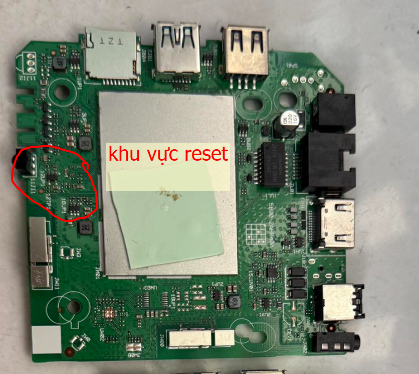
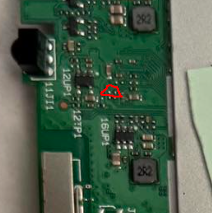

# HP40A-Firmware-Flasher - Bộ Công Cụ Flash Firmware

## Mô Tả Dự Án

Đây là bộ công cụ chính thức để flash/cài đặt lại firmware cho thiết bị **HP40A AndroidTV/Set-top Box** của **Viettel**. Bộ công cụ này cho phép bạn khôi phục firmware gốc hoặc cập nhật firmware mới cho thiết bị.
Created by ĐẠT MÊ CÁ.

## Cấu Trúc Thư Mục

```
HP40A-Firmware-Flasher/
├── README.md                          # File hướng dẫn này
├── hp40a khien evoca atv10/          # Gói firmware chính
│   ├── EMMC_AUTO.BIN.BOOT1           # Bootloader (firmware khởi động)
│   ├── HP40a.bat                     # Script cài đặt firmware (Windows)
│   └── tool/                         # Các công cụ hỗ trợ
│       ├── magic.mgc                 # File magic cho nhận dạng định dạng
│       ├── mke2fs.conf               # Cấu hình tạo filesystem ext2/ext3/ext4
│       ├── XEM                       # Công cụ quản lý EMMC
│       └── firmware/logoviettel/     # Firmware chính (branding Viettel)
└── Tool Driver/                      # Trình điều khiển USB
    └── usb_driver/
        ├── android_winusb.inf        # File cấu hình driver USB
        ├── androidwinusb86.cat       # Chứng chỉ cho Windows 32-bit
        ├── androidwinusba64.cat      # Chứng chỉ cho Windows 64-bit
        ├── i386/                     # Driver cho hệ thống 32-bit
        └── amd64/                    # Driver cho hệ thống 64-bit
```

- Giải nén hp40a khien evoca atv10.rar vào thư mục `HP40A-Firmware-Flasher/`
- Giải nén Tool Driver.rar vào thư mục `HP40A-Firmware-Flasher/`
- Pass giải nén: chucbanthanhcong

## Yêu Cầu Hệ Thống

- **Hệ điều hành**: Windows XP, Vista, 7, 8, 10, 11 (32-bit hoặc 64-bit)
- **Thiết bị**: HP40A AndroidTV/Set-top Box
- **Kết nối**: Cáp USB để kết nối thiết bị với máy tính
- **Quyền hạn**: Quyền Administrator để cài đặt driver

## Hướng Dẫn Cài Đặt

### Bước 1: Cài Đặt Driver USB + USB
#### Cài đặt driver USB
1. Tắt thiết bị HP40A hoàn toàn
2. Mở thư mục `Tool Driver/usb_driver/`
3. Nhấp chuột phải vào `android_winusb.inf` → **Install**
4. Chọn thư mục tương ứng với hệ thống của bạn:
   - **Windows 32-bit**: Dùng driver từ thư mục `i386/`
   - **Windows 64-bit**: Dùng driver từ thư mục `amd64/`
5. Chờ quá trình cài đặt hoàn tất

#### Chuẩn bị USB
1. Cắm một USB vào máy tính
2. Định dạng USB sang FAT32 (chuột phải vào ổ USB → Format → Chọn FAT32)
3. Dùng Win32DiskImager hoặc công cụ tương tự để ghi file `EMMC_AUTO.BIN.BOOT1` vào USB
4. Sau khi ghi xong, rút USB ra khỏi máy tính và cắm vào HP40A ở cổng USB màu đen

### Bước 2: Flash Firmware

1. Kết nối HP40A với máy tính bằng cáp USB
2. Chuyển thiết bị vào chế độ Recovery/Download:


- Chạm 2 điểm trên thiết bị sau đó cắm nguồn để vào Recovery Mode
- Chờ đến khi Laptop nhận thiết bị(âm thanh kết nối USB).

3. Mở thư mục `HP40A-Firmware-Flasher/hp40a khien evoca atv10/`
4. Nhấp đôi vào `HP40a.bat` để khởi động quá trình flash
5. Chờ quá trình hoàn tất (không ngắt kết nối USB)
6. Thiết bị sẽ khởi động lại tự động

**Lưu ý*: Quá trình flash nếu hiện thông báo: `<... any device>` thì rút nguồn thiết bị>cắm nguồn>mở device manager trên máy tính>chọn thiết bị có dấu chấm than>cập nhật driver>chọn driver ở thư mục `Tool Driver/usb_driver`. Sau đó chạy lại `HP40a.bat`.

### Bước 3: Cấu Hình Ban Đầu

Sau khi cài đặt xong, bạn sẽ cần:
- Cấu hình ngôn ngữ, múi giờ
- Kết nối WiFi/Ethernet
- Đăng nhập tài khoản Viettel (nếu có)

## Hỗ Trợ

Nếu cần hỗ trợ:
- Liên hệ với nhà cung cấp thiết bị HP40A
- Kiểm tra lại toàn bộ các bước trên
- Đảm bảo driver USB đã được cài đặt chính xác

## Phiên Bản

- **Phiên bản firmware**: HP40A Ver 10
- **Thiết bị hỗ trợ**: HP40A AndroidTV/Set-top Box (Khien Evoca ATV10)

---

**Chú ý**: Đây là bộ công cụ dành riêng cho thiết bị HP40A. Sử dụng công cụ này cho các thiết bị khác có thể gây hư hại.

**Bộ công cụ chỉ cung cấp cho mục đích nghiên cứu, không thương mại và không chịu trách nhiệm về bất kỳ thiệt hại nào có thể xảy ra khi sử dụng.**
